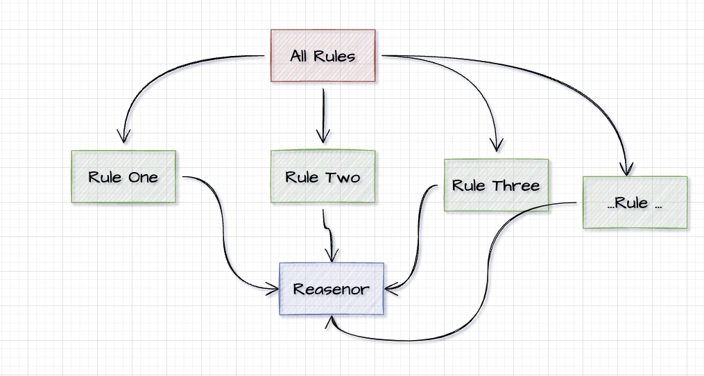

# Output Example

<center></center>

# Reasoner-Multiprocessing
I got an error while running too many rules on owlready2 on reasoner. I wanted to find a solution to this situation.

Error Preview;

    java.lang.OutOfMemoryError: Java heap space:failed reallocation of scalar replaced objects.

Increasing the "Java Heap Size" was a bit of a solution, but still not enough.

# Solution
This algorithm may not be correctly, but it can work for project or something. Let me explain how to solve it.

Split all the rules and send all them to the reasoner.


# Algorithm


# How to use it?

You can check <a href="https://github.com/AliYmn/Reasoner-Multiprocessing/blob/master/src/reasoner.py">"src/reasoner.py"</a> all codes.

```python
from reasoner import Reasoner

file_name = "example.owl"
reasoner_type = "pellet"
sleep_time = 10
infer_property_values = True
infer_data_property_values = True

Reasoner(
        file_name = file_name,
        reasoner_type = reasoner_type,
        sleep_time = sleep_time,
        infer_property_values = infer_property_values,
        infer_data_property_values = infer_data_property_values,
).run()
```
